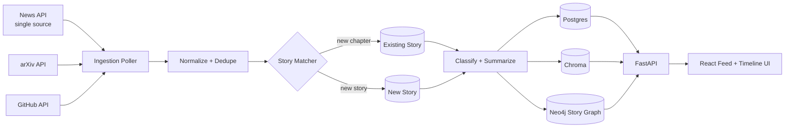

# AI News Agent — High-Level & Low-Level Design
**Team:** Chronologix &nbsp;|&nbsp; **Scope revision:** single news API integration, chronology-first design

---

## 0. Design Framing

Your instructors' feedback — *"bridge the gap in the chronology of news, how news is progressing"* — is the design driver for this whole document. It reframes the project from "aggregate and tag AI news items" to:

> Given a stream of individually-published articles, reconstruct the **evolving storylines** they belong to, and present each storyline as an ordered timeline rather than a flat feed.

That single sentence is why this document introduces a new first-class entity — the **Story** — that didn't exist in your original architecture. Everything below is built around making chronology a structural property of the data model, not a UI sorting trick.

---

## PART 1 — HIGH-LEVEL DESIGN (HLD)

### 1.1 Problem Statement

A flat, timestamp-sorted feed of AI news fails to answer the question a reader actually has: *"what's the state of this situation, and how did we get here?"* Three articles about the same model release, spaced a week apart, should render as one growing timeline — not three unrelated feed cards.

### 1.2 System Context



### 1.3 Layered Architecture (revised for single-API scope)

| Layer | Responsibility | Change from original proposal |
|---|---|---|
| Ingestion | Poll one news API + arXiv + GitHub on independent schedules | Simplified — no multi-outlet cross-source dedup needed for news |
| Normalize & Dedupe | Exact dedup (hash/ID) + **story matching** (replaces old "semantic dedup") | Semantic step now classifies into 3 outcomes, not 2 |
| Enrichment | Tag, summarize, embed | Unchanged |
| Chronology (**new**) | Maintain Story entities, order items within a story, compute story-level metadata (status, momentum, last update) | New subsystem — this is the core deliverable |
| Persistence | Postgres (items, stories), Chroma (vectors), Neo4j (story graph + topic graph) | Neo4j now models *time-ordered* story chains, not just topic clustering |
| API | FastAPI: feed, story timeline, topic graph | Add `/stories` and `/stories/{id}/timeline` |
| Frontend | Feed view + **Timeline view** (new) + topic graph explorer | Timeline view is a new UI surface |

### 1.4 The Chronology Subsystem — Core Design

This is the part that answers your instructors' feedback directly.

**Concept:** every ingested item is either:
1. A **duplicate** — same event, arrived again (skip / merge)
2. A **new chapter** in an existing story — related event, later in time (attach)
3. A **new story** — nothing like it exists yet (create)

The classification isn't a single similarity check — it combines **semantic similarity** with **temporal distance**, because those two signals mean different things together than apart:

| Semantic similarity | Time gap | Classification |
|---|---|---|
| Very high (>0.92) | Small (<48h) | Duplicate — same event, different phrasing/outlet |
| High (0.75–0.92) | Any (hours to weeks) | New chapter — same storyline progressing |
| Moderate (0.6–0.75) | Large (weeks+) | Possible new chapter — flag for the agent to reason about explicitly (e.g. "is this a sequel story or a coincidentally similar unrelated one?") |
| Low (<0.6) | — | New story |

The middle band is intentionally ambiguous — this is where you actually need the LLM/agent to reason (e.g. "OpenAI releases GPT-5" and "OpenAI releases GPT-5.2" are similar and *should* chain; "OpenAI releases GPT-5" and "Anthropic releases Claude 5" are similar and should *not*). A pure cosine-similarity cutoff will get this wrong sometimes — that reasoning step is why this is an agentic decision, not a simple threshold.

### 1.5 Tech Stack (updated)

| Component | Choice | Note |
|---|---|---|
| News source | One news API (your choice: NewsAPI or GNews) | Simplifies ingestion; revisit multi-source later if time allows |
| Research source | arXiv API | Unchanged |
| Tool-release source | GitHub API | Unchanged |
| Relational store | Postgres | `items`, `stories` tables (see LLD) |
| Vector store | Chroma | Item + story-centroid embeddings |
| Graph store | Neo4j | Story chains + topic graph |
| Agent orchestration | LangGraph | Story-matching decision agent |
| Backend | FastAPI | |
| Frontend | React + D3 | Feed, **Timeline**, Graph explorer |

### 1.6 Non-Functional Requirements

- **Extensibility**: single-news-API design should not hardcode that assumption into the schema — `items.source_name` stays a field, not an enum baked into table structure, so adding a second source later doesn't require a migration.
- **Idempotency**: re-running a poller on overlapping time windows must not create duplicate stories.
- **Explainability**: the story-matching decision (why item X was attached to story Y) should be logged, since this is the part most likely to be wrong and need debugging/demo explanation.

---

## PART 2 — LOW-LEVEL DESIGN (LLD)

### 2.1 Data Model

**Postgres — `items`**

| Column | Type | Notes |
|---|---|---|
| id | UUID PK | |
| source_type | text | `news` / `paper` / `tool` |
| source_name | text | e.g. the news API name |
| external_id | text | URL hash / arXiv ID / release tag |
| title | text | |
| raw_text | text | |
| url | text | |
| published_at | timestamptz | from source |
| ingested_at | timestamptz | |
| story_id | UUID FK → stories.id | nullable until matched |
| summary | text | filled at enrichment stage |
| tags | text[] | subfield tags |

**Postgres — `stories`**

| Column | Type | Notes |
|---|---|---|
| id | UUID PK | |
| title | text | auto-generated from first item, editable |
| status | text | `active` / `dormant` (no update in N days) / `resolved` |
| first_seen_at | timestamptz | |
| last_updated_at | timestamptz | |
| centroid_embedding_id | text | pointer to Chroma story-centroid vector |
| item_count | int | denormalized for feed sorting |

**Chroma collections**

- `item_vectors`: id = item.id, metadata = `{story_id, published_at}`
- `story_centroids`: id = story.id, vector = running mean of member item vectors (recomputed on each new chapter — cheap incremental update: `new_centroid = old_centroid + (new_vec - old_centroid) / item_count`)

**Neo4j graph model**

```cypher
(:Story {id, title, status})
(:Item {id, title, published_at})
(:Topic {name})

(:Story)-[:HAS_CHAPTER {sequence: int}]->(:Item)
(:Item)-[:FOLLOWS {gap_hours: float}]->(:Item)   // chronological chain within a story
(:Item)-[:ABOUT]->(:Topic)
```

The `FOLLOWS` chain is what makes timeline reconstruction a single traversal instead of an application-side sort.

### 2.2 Core Algorithms (pseudocode)

**A. Ingestion poller (single news API)**

```
last_cursor = get_last_poll_timestamp(source="news_api")
response = news_api.fetch(since=last_cursor)
for raw_item in response:
    normalized = normalize(raw_item)     # canonical URL, stripped tracking params
    write_to_staging(normalized)
set_last_poll_timestamp(source="news_api", value=now())
```

**B. Dedup + story-matching classifier** (runs per staged item)

```
canonical_hash = hash(normalized.canonical_url)
if canonical_hash in recent_hash_cache:
    discard()  # exact duplicate, stop here

embedding = embed(normalized.title + normalized.summary_snippet)
candidates = chroma.query(story_centroids, embedding, top_k=5)

best = candidates[0]
gap_hours = hours_between(normalized.published_at, best.story.last_updated_at)

if best.similarity > 0.92 and gap_hours < 48:
    action = MERGE_DUPLICATE
elif best.similarity > 0.75:
    action = ATTACH_NEW_CHAPTER
elif 0.6 < best.similarity <= 0.75:
    action = ASK_AGENT   # ambiguous band — LangGraph node reasons about it
else:
    action = CREATE_NEW_STORY
```

**C. Ambiguous-band agent decision** (LangGraph node, only for the `ASK_AGENT` case)

```
prompt: "Item A: {title/summary}. Candidate story B, most recent chapter:
{title/summary}. Is item A a later development of the same real-world
situation as story B, or a separate but topically similar event?
Answer: SAME_STORY or DIFFERENT_STORY, with one-sentence reasoning."
```

**D. Timeline reconstruction (Cypher, used by the `/stories/{id}/timeline` endpoint)**

```cypher
MATCH (s:Story {id: $storyId})-[:HAS_CHAPTER]->(i:Item)
RETURN i.title, i.published_at, i.id
ORDER BY i.published_at ASC
```

### 2.3 API Contracts

| Endpoint | Method | Returns |
|---|---|---|
| `/feed` | GET | Paginated items, newest first, each annotated with `story_id` and `story_title` |
| `/stories` | GET | List of active stories sorted by `last_updated_at`, with `item_count` |
| `/stories/{id}/timeline` | GET | Ordered chapters for one story (title, summary, published_at per chapter) |
| `/topics/{name}/graph` | GET | Neo4j topic subgraph for the graph explorer view |

### 2.4 End-to-End Sequence (new article arrives)

1. Poller fetches item since last cursor → writes to staging.
2. Exact-dedup hash check → if duplicate, stop.
3. Embed title+snippet → query story centroids in Chroma.
4. Classify: merge / new chapter / ambiguous (agent) / new story.
5. If new chapter: increment `stories.item_count`, update centroid, set `item.story_id`, add `HAS_CHAPTER` + `FOLLOWS` edges in Neo4j.
6. If new story: create `stories` row, create Neo4j `:Story` node with first `HAS_CHAPTER` edge.
7. Classify/tag/summarize the item (single LLM call).
8. Item is now queryable via `/feed` and, if part of a multi-chapter story, via `/stories/{id}/timeline`.

### 2.5 Frontend Components

- **Feed view**: existing card-per-item list; each card shows a "Part of an ongoing story →" link when `story_id` is present.
- **Timeline view** (new): vertical chronological layout per story — chapter 1 at top, each subsequent chapter below with its own summary and timestamp, visually connected by a line (this is the direct UI answer to "chronology").
- **Graph explorer**: unchanged from original proposal — topic-level view, separate from the per-story timeline.

### 2.6 Suggested Build Order

1. Single-source ingestion poller + Postgres `items` table (no story logic yet).
2. Exact dedup only.
3. Add `stories` table + centroid matching with **fixed thresholds only** (skip the ambiguous-band agent step initially — hardcode it to `CREATE_NEW_STORY` as a fallback).
4. Get `/stories/{id}/timeline` and the Timeline UI working end-to-end on this simplified version — this is your demoable milestone.
5. Only then add the LangGraph ambiguous-band reasoning step — it's a refinement on top of a working chronology system, not a prerequisite for one.
6. Layer in the topic-level Neo4j graph explorer last, as originally planned.

---

*Open decision for your team to confirm: which single news API (NewsAPI vs GNews) — this doesn't affect the design above, only the poller's request/response parsing.*
